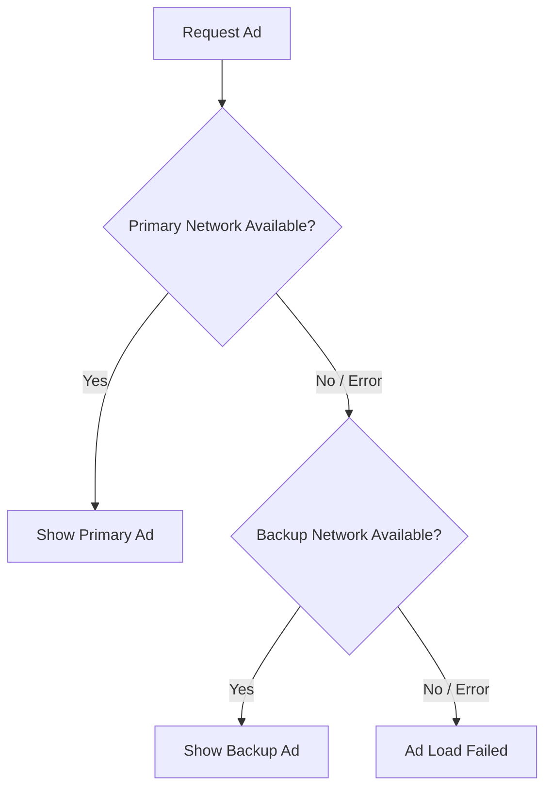

# AdGlide SDK

A powerful, multi-network Android ad library that simplifies integrating and managing ads from multiple ad platforms. Built with a clean **Builder pattern** API, automatic **fallback** to backup networks, and full **GDPR** compliance support.

   

---

## ✨ Features

- 🔌 **Multi-Network Support** — AdMob, Google Ad Manager, Meta Audience Network (FAN), AppLovin, Unity Ads, ironSource, Wortise, StartApp
- 🔄 **Automatic Fallback** — Primary + backup ad network with seamless failover
- 🏗️ **Builder Pattern API** — Clean, fluent configuration for all ad formats
- 🛡️ **GDPR Compliance** — Google UMP consent integration with debug mode support
- 📱 **6 Ad Formats** — Banner, Interstitial, Native, Rewarded, Medium Rectangle, App Open
- 🎨 **Customizable Native Ads** — Multiple styles (small, medium, large, news, video) with dark theme support
- 🧹 **Memory Safe** — Built-in `destroy()` methods on every ad format to prevent leaks
- 📦 **ProGuard Ready** — Consumer rules auto-applied to host apps
- 🔗 **FAN Bidding** — Meta Audience Network bidding for AdMob and Ad Manager

## 🔄 Ads Fallback Logic



---

## 📦 Installation

### 1. Add JitPack Repository

Add `maven { url 'https://jitpack.io' }` to your `settings.gradle` (or root `build.gradle`):

```gradle
dependencyResolutionManagement {
    repositoriesMode.set(RepositoriesMode.FAIL_ON_PROJECT_REPOS)
    repositories {
        google()
        mavenCentral()
        maven { url 'https://jitpack.io' }
    }
}
```

### 2. Add Dependency

Add the dependency in your app-level `build.gradle`:

```gradle
dependencies {
    implementation 'com.github.partharoypc:adglide:1.0.0'
}
```

> [!NOTE]
> The library automatically includes dependencies for AdMob, FAN, Google UMP, and AndroidX libraries. You generally **do not** need to add these manually to your app unless you need specific versions.

---

## 🚀 Quick Start

### 1. Initialize Ad Networks

Initialize the SDK in your `Application` class or main `Activity`.

```java
new AdNetwork.Initialize(activity)
    .setAdStatus("1")           // "1" = ON, "0" = OFF
    .setAdNetwork("admob")      // Primary network
    .setBackupAdNetwork("fan")  // Backup network (optional)
    .setAdMobAppId("ca-app-pub-xxxxx~xxxxx")
    .setDebug(BuildConfig.DEBUG) // Enable debug logging
    .build();
```

### 2. Load a Banner Ad

```java
BannerAd.Builder bannerAd = new BannerAd.Builder(activity)
    .setAdStatus("1")
    .setAdNetwork("admob")
    .setBackupAdNetwork("fan")
    .setAdMobBannerId("ca-app-pub-xxxxx/xxxxx")
    .setFanBannerId("YOUR_FAN_BANNER_ID")
    .setDarkTheme(false)        // Toggle dark mode support
    .setPlacementStatus(1)      // 1 = Show, 0 = Hide specific placement
    .setLegacyGDPR(false)       // Use new UMP instead of legacy GDPR
    .build();

bannerAd.loadBannerAd();

// 🧹 Clean up in onDestroy()
@Override
protected void onDestroy() {
    super.onDestroy();
    bannerAd.destroyAndDetachBanner();
}
```

### 3. Load an Interstitial Ad

```java
InterstitialAd.Builder interstitialAd = new InterstitialAd.Builder(activity)
    .setAdStatus("1")
    .setAdNetwork("admob")
    .setBackupAdNetwork("fan")
    .setAdMobInterstitialId("ca-app-pub-xxxxx/xxxxx")
    .setFanInterstitialId("YOUR_FAN_INTERSTITIAL_ID")
    .setInterval(3)             // Show ad every 3 valid attempts
    .build();

interstitialAd.loadInterstitialAd();

// Call this when you want to show the ad (e.g., after game over)
interstitialAd.showInterstitialAd();

// 🧹 Clean up
interstitialAd.destroyInterstitialAd();
```

### 4. Load a Native Ad

```java
NativeAd.Builder nativeAd = new NativeAd.Builder(activity)
    .setAdStatus("1")
    .setAdNetwork("admob")
    .setBackupAdNetwork("fan")
    .setAdMobNativeId("ca-app-pub-xxxxx/xxxxx")
    .setFanNativeId("YOUR_FAN_NATIVE_ID")
    .setNativeAdStyle("medium") // Options: small, medium, large, news, radio, video_small, video_large
    .setNativeAdBackgroundColor(R.color.colorLight, R.color.colorDark)
    .build();

nativeAd.loadNativeAd();

// 🧹 Clean up
nativeAd.destroyNativeAd();
```

### 5. Load a Rewarded Ad

```java
RewardedAd.Builder rewardedAd = new RewardedAd.Builder(activity)
    .setAdStatus("1")
    .setMainAds("admob")
    .setBackupAds("fan")
    .setAdMobRewardedId("ca-app-pub-xxxxx/xxxxx")
    .build(
        () -> { 
            // 🎁 Reward earned! Grant user currency/lives here.
            Log.d(TAG, "User earned reward");
        },
        () -> { 
            // Ad dismissed. Resume game/app flow.
            Log.d(TAG, "Ad dismissed");
        }
    );

rewardedAd.loadRewardedAd(onComplete, onDismiss);

// Show when ready
rewardedAd.showRewardedAd(onComplete, onDismiss, onError);
```

### 6. Load an App Open Ad

Usually implemented in your `Application` class or splash screen.

```java
AppOpenAd.Builder appOpenAd = new AppOpenAd.Builder(activity)
    .setAdStatus("1")
    .setAdNetwork("admob")
    .setBackupAdNetwork("google_ad_manager")
    .setAdMobAppOpenId("ca-app-pub-xxxxx/xxxxx")
    .build();

appOpenAd.loadAppOpenAd();

// Show immediately if loaded
appOpenAd.showAppOpenAd();

// 🧹 Clean up
appOpenAd.destroyOpenAd();
```

---

## 🛡️ GDPR Consent

The SDK supports Google's User Messaging Platform (UMP) for GDPR compliance.

### Google UMP (Recommended)

```java
GDPR gdpr = new GDPR(activity);

// Simple consent flow - automatically determines if consent is needed
gdpr.updateGDPRConsentStatus();

// Advanced consent flow with debug mode (force geography)
// Useful for testing GDPR dialogs outside of EEA
gdpr.updateGDPRConsentStatus("admob", true, false); 
```

---

## 🔧 Troubleshooting

| Issue | Possible Cause | Solution |
|---|---|---|
| **No Ads Loading** | Incorrect Application ID | Verify `AndroidManifest.xml` has the correct `com.google.android.gms.ads.APPLICATION_ID`. |
| **"Cleartext traffic not permitted"** | HTTP connection blocked | Add `android:usesCleartextTraffic="true"` to your `<application>` tag in Manifest. |
| **Native Ad Layout Issues** | Wrong style constant | Ensure you pass a valid style string (e.g., `"medium"`, `"large"`) to `setNativeAdStyle`. |
| **Class Def Not Found** | ProGuard stripping | ProGuard rules are auto-included, but ensure your app's `minifyEnabled` build config is correct. |

---

## 🔌 Supported Ad Networks

| Network | Constant | Format Support |
|---|---|---|
| **AdMob** | `admob` | Banner, Interstitial, Native, Rewarded, App Open |
| **Google Ad Manager** | `google_ad_manager` | Banner, Interstitial, Native, Rewarded, App Open |
| **Meta Audience Network** | `fan` | Banner, Interstitial, Native, Rewarded |
| **AppLovin MAX** | `applovin_max` | Banner, Interstitial, Native, Rewarded, App Open |
| **Unity Ads** | `unity` | Banner, Interstitial, Rewarded |
| **ironSource** | `ironsource` | Banner, Interstitial, Rewarded |
| **StartApp** | `startapp` | Banner, Interstitial, Native |
| **Wortise** | `wortise` | Banner, Interstitial, Native, Rewarded, App Open |

---

## 🧹 Memory Management

**Crucial:** Always call the `destroy` method in your Activity or Fragment's `onDestroy()` lifecycle event. Failure to do so can lead to memory leaks and performance degradation.

```java
@Override
protected void onDestroy() {
    super.onDestroy();
    if (bannerAd != null) bannerAd.destroyAndDetachBanner();
    if (interstitialAd != null) interstitialAd.destroyInterstitialAd();
    if (nativeAd != null) nativeAd.destroyNativeAd();
    if (appOpenAd != null) appOpenAd.destroyOpenAd();
}
```

---

## 📁 Project Structure

```text
library/src/main/java/com/partharoypc/adglide/
├── format/                    # Core logic for each ad format
├── gdpr/                      # Consent management (GDPR/UMP)
├── helper/                    # Initialization helpers
├── ui/                        # Custom View classes (BannerAdView, NativeAdView)
└── util/                      # Constants, tools, and listeners
```

---

## 📄 License

Copyright © Partha Roy. All rights reserved.
